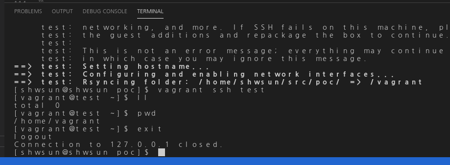
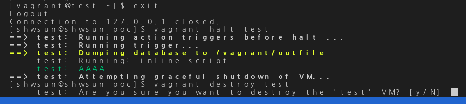
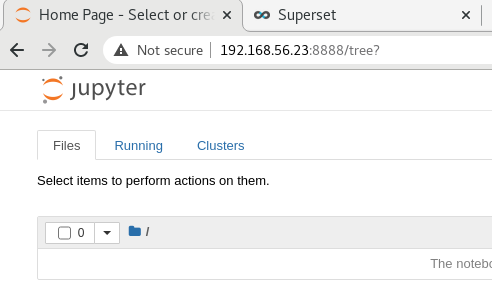

# K8s 연습 프로젝트

CentOS7 K8s 클러스터 개발환경을 IaC(Infrastructure as Code)형태로 Windows 컴퓨터에 구축하는 샘플 프로젝트 입니다.  
아래와 같은 환경을 구축할 계획 입니다.  
1. VM 생성 개발 도구 
2. 간단한 test VM
3. 주피터 노트북 샘플 VM 
4. K8s 클러스터
5. K8s 클러스터 Web UI 대시보드(외부 조회 가능)
6. Python Jupyter Notebook 실행 VM
7. python 개발환경(주피터 노트북)을 pod로 서비스하고 외부 호출 가능하게 생성.
  
전체 과정을 설명하면 문서가 너무 길어지기 때문에, 이 문서에서는 `주피터 노트북 샘플 VM` 까지만 설명하고,  
다른 문서에서 나머지 설치 과정과 사용 방법을 설명할 계획 입니다.  
  
VM 환경을 먼저 개발하지만, 컨테이너 환경에서도 재사용 가능하도록 개발할 예정입니다.  
shell 형태로 작성할 설치 항목들은 향후 ansible 에서 재사용 할 예정입니다.  
  
  >>작성해 둔 K8S Web Dashboard UI 가 작동하고 있는 URL 다음과 같습니다.  
  >>VM K8s master API URL (VM 버전으로 GPU 사용 불가)  
  >>  [http://<HOST_IP>:18001/api/v1/namespaces/kubernetes-dashboard/services/https:kubernetes-dashboard:/proxy]  
  
Linux Host 머신에서 다시 Linux를 서비스하는 VM 환경을 구축하는 샘플을 편집했기 때문에,  
군데군데 windows 용 command가 아닌 linux(centos) 용 명령어가 등장하는 경우가 있습니다.  
해당 명령어에 대응하는 window command로 변환해서 이해하시기 바랍니다.  
  
### 참고 자료
####  예제
[Examples](./examples/Examples.MD)
####  도커 사용 기본 예제
[도커 사용 기본 예제 설명](./examples/docker/Docker-Tutorial.MD)
#### 쿠버네티스 기본 예제
[쿠버네티스 클러스터 기본 예제 설명](./examples/k8s/tutorials/K8S-Tutorial.MD)
  
---  
## 프로젝트 폴더 구조
- ROOT : 설치를 지휘하는 vagrant script 파일과 도움말 파일.  
- examples : 사용하는 방법에 대한 예제 파일.  
  >> [Examples](./examples/Examples.MD)
- imgs : 도움말 파일 등에서 사용하는 이미지 파일.
- shells : vm이나 컨테이너 생성시 사용할 개별 어플리케이션이나 도구 설치 스크립트 파일  
- setups : 원격 저장소에서 설치에 필요한 파일을 가져오기 어려운 경우 미리 다운 받은 파일을 이 위치에 둘 예정입니다.  


소스 저장소 용량상 다운로드 받은 파일을 올리지 않고, 다운로드 받을 파일명과 경로를 아래와 같이 설명해 두었습니다.   
  
---  
## Vagrant 와 Virtualbox 설치하기

Vagrant 와 VirtualBox를 이용해 인프라 환경을 구축하고 관리하는 방법을 설명합니다.   
아래 설치 파일 url 을 이용해서 설치파일을 다운로드 받습니다.  
  
***Requirements***  
 - Virtualbox  
 - Vagrant  
 - virtual box os image(.box) for centos 7   

### download URL 

1. download oracle virtual box 6.1.18   
    - Windows 용 : https://download.virtualbox.org/virtualbox/6.1.18/VirtualBox-6.1.18-142142-Win.exe   
2. download vagrant 설치 file. 2.2.14   
    - Windows 용 : https://releases.hashicorp.com/vagrant/2.2.14/vagrant_2.2.14_x86_64.msi  
3. downloqd centos 7 image v.2004.01  
    - https://cloud.centos.org/centos/7/vagrant/x86_64/images/CentOS-7-x86_64-Vagrant-2004_01.VirtualBox.box  
4. virtual box 설치 : 클릭해서 설치 진행.  
5. vagrant 설치 : 클릭해서 설치 진행.  
6. CentOS vagrant 설치 이미지를 등록 - 네트웍이 충분히 빠르다면 실행 중에 자동 다운로드 되기 때문에 생략 가능  

```bash
# 위 3번에서 다운받은 centos image를 vagrant cache에 추가  
# 베이그런트에 한번 등록해 두면 내부 캐쉬에 저장되서 이후에는 이름으로 바로 호출 가능.
# 매 번 다운로드 받아서 등록해 줄 필요 없음.  
# 단, 베이그런트 완전 삭제시에는 캐쉬가 사라지므로 이미지 파일을 다시 등록해야 사용 가능.  
vagrant box add centos/7 CentOS-7-x86_64-Vagrant-2004_01.VirtualBox.box
```
CentOS7 설치 이미지는 파일 크기가 상당히 크기 때문에 다운로드 받는 데 오래 걸립니다.   
재사용 가능성이 있으면 보관해 두는 것이 좋습니다.    

---  
## test VM 이용한 맛보기 실행  
Vagrant 와 VirtualBox를 이용해서 간단한 가상머신을 생성하고 실행해 봅니다.  
`Vagrantfile` 파일이 존재하는 경로에서 `vagrant` 명령을 실행해야 합니다.  
  
가상머신에 CentOS/7을 설치하고 IP를 부여하기만 했습니다.  
CentOS 설치 이미지 파일에 문제가 없다면, 정상 실행될 가능성이 높습니다.  
  
`Vagrantfile` 이 위치한 경로에서 아래와 같은 명령을 입력하면 test용 헤드리스(UI 없는) 리눅스가 실행됩니다.  
```bash
vagrant up test
```
실행중인 VM 에 연결하려면 아래와 같은 명령을 입력합니다.  
```bash
vagrant ssh test
```
  
  
VM 연결된 상태를 해결하려면 리눅스 콘솔에서 `exit`을 입력합니다.  
```bash
exit
```
여기까지 진행한 콘솔창 상태는 아래와 같습니다.  
 
  
실행해 둔 VM 을 정지하려면 아래와 같이 입력합니다.  
VM 생성 내역을 모두 삭제하려면 역시 아래와 같이 입력합니다.  
```bash
vagrant halt test
vagrant destroy test 
```
   
  
test VM을 생성하는 vagrant script는 아래와 같습니다.  
```ruby 
Vagrant.configure("2") do |config|
    # installed in /opt/vagrant/embedded .... gemrc 
    # https://cloud.centos.org/centos/7/vagrant/x86_64/images/CentOS-7-x86_64-Vagrant-2004_01.VirtualBox.box
    # vagrant box add centos/7 CentOS-7-x86_64-Vagrant-2004_01.VirtualBox.box
    # config.vbguest.auto_update = false
    # test linux 
    # 연습으로 깡통 리눅스만 올려 봅니다. 
    # vagrant up test 명령이 실행 완료되면, 리눅스 가상머신이 생성됩니다.
    # vagrant ssh test 로 리눅스 운영체제에 콘솔 연결할 수 있습니다. 
    config.vm.define "test" do |vname|
        vname.vm.box = "centos/7"
        vname.vm.hostname = "test"

        vname.trigger.before :halt do |trigger|
            trigger.warn = "Dumping database to /vagrant/outfile"
            trigger.run_remote = {inline: "echo AAAA"}
        end

        vname.vm.provider "virtualbox" do |vb|
            vb.name = "test"
            vb.customize ['modifyvm', :id, '--audio', 'none']
            vb.memory = 1000
            vb.cpus = 2
        end
        vname.vm.network "private_network", ip: "192.168.56.20"
    end
end 
```
---  
## Jupyter Notebook VM
CentOS/7 vm 에 파이썬3을 설치하고 파이썬 코드를 실행할 수 있는 주피터 노트북을 설치해 실행해 봅니다.  
앞서 생성한 `test` vm 처럼 OS 이미지를 올려 vm 을 생성하고, 그 os 위에서 설치를 진행하는 형태 입니다.  
설치를 실행했던 명령을 일괄 설치가 가능한 스크립트로 만들고 vagrant에서 순서대로 실행해 주면,  파이썬3용 주피터 노트북이 실행되는 환경을 바로 생성할 수 있습니다.  
파이썬과 주피터 노트북 설치 스크립트는 `./shells/boot_jupyter.sh`와 `./shells/start_jupyter.sh`로 미리 작성해 두었습니다.  
필요한 파일을 설치하는 작업은 vm 생성 시 한 번만 진행하면 되고, 실행 프로그램인 주피터 노트북을 실행하는 작업은 vm이 새로 기동할 때 마다 매 번 실행해야 합니다.  
Vagrantfile Provisioning 블럭에 이 부분을 감안해서 쉘 스크립트 실행 옵션을 `once`, `always` 같이 지정해 두었습니다.  
매 번 실행하기 귀찮은 경우에는 서비스로 등록해 두면 설치 스크립트에 포함해서 `once`로만 실행되도록 작성할 수도 있습니다.  

전체 스크립트는 아래와 같습니다.   
```ruby
Vagrant.configure("2") do |config|
    # Jupyter Notebook
    # http://192.168.56.23:8888 
    config.vm.define "jup" do |vname|
        vname.vm.box = "centos/7"
        vname.vm.hostname = "jup"
        vname.vm.provider "virtualbox" do |vb|
            vb.name = "jup"
            vb.customize ['modifyvm', :id, '--audio', 'none']
            vb.memory = 1000
            vb.cpus = 2
        end
        vname.vm.network "private_network", ip: "192.168.56.23"
        vname.vm.network "forwarded_port", guest: 8888, host: 8888
        # provisioning
        vname.vm.provision "shell", path: "./shells/boot_jupyter.sh", run: "once"
        vname.vm.provision "shell", path: "./shells/start_jupyter.sh", run: "always"
    end
end
```
  
작성해 둔 주피터 노트북용 vm은 아래와 같이 실행합니다.  
```bash
vagrant up jup
# http://<vm ip address>:8888
# type http://192.168.56.23:8888 in webbrowser. 
```
주피터 실행 시, 인증 정보를 입력받지 않도록 강제 처리했기 때문에 URL만으로 호출할 수 있습니다.  
주피터 서버를 실행하고 있는 머신(여기에서는 vm)의 ip 주소는 `192.168.56.23` 이기 때문에, 개발자 컴퓨터의 웹 브라우저에서 vm ip를 입력하면 아래와 같은 실행 화면을 확인할 수 있습니다.  
 
  
베이그런트 스크립트에 `forwarded_port`가 지정되어 있기 때문에, vm 주소가 아닌 사용자 컴퓨터의 주소 중 `8888` 포트는 외부에서 사용자 컴퓨터의 ip를 호출할 경우,  
실행 중인 주피터 vm 의 8888 포트에 리다이렉트됩니다.  
외부에서 `http://<사용자 컴퓨터 ip>:8888`을 입력하면 주피터 노트북에 연결할 수 있습니다.  
  
  
***2021.01 Visual Studio Code 최신본을 받지 않아야 한다. 신규 업데이트 부터는 centos7 에서 정상 작동하지 않는다. ***   
