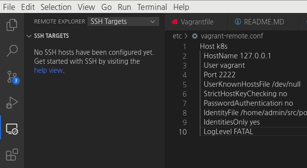
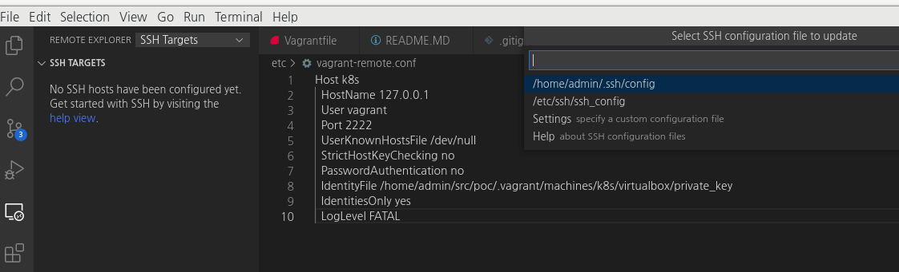
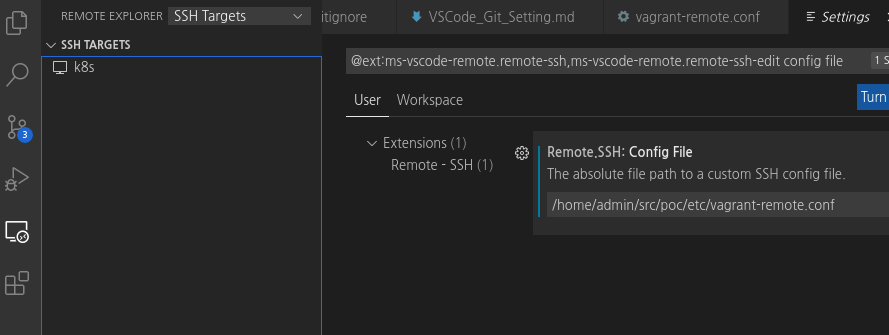
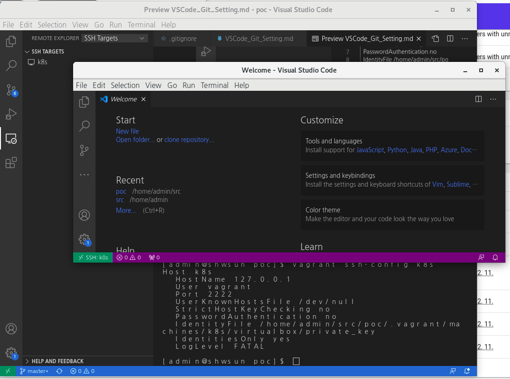

# Visual Studio Code 개발환경 설정하기
Visual Studio Code 가 설치되어 있다고 가정합니다.  
이 글의 작성은 Windows 10 환경에서 진행했지만, 대부분의 경우 Linux에서도 동일하게 작동합니다.  
  

## Git Hub 연결 설정
### Git 2.x install
```bash
sudo yum -y install https://packages.endpoint.com/rhel/7/os/x86_64/endpoint-repo-1.7-1.x86_64.rpm
sudo yum install -y git 
```
  
### Git init
```bash
# Git config 리셋 
# 처음 설치하거나, system이나 global 영역에 설정된 내역이 없으면 삭제할 내역이 없다는 경고 메시지가 출력됩니다. 무시합니다. 
git config --system --unset credential.helper
git config --global --unset credential.helper
# Git 계정 정보 입력
git config user.email "shwsun@naver.com"
git config user.name "poc"

git remote add origin "http://10.250.106.233/root/iac_test"
```
  
Visual Studio Code `Git` plugin 에 필요없는 REMOTES 가 존재하면 아래와 같은 명령으로 수동 삭제할 수 있습니다. 
```bash
git remote remove <삭제할 이름>
```
위와 같이 삭제해도 폴더명이 보입니다.  
해당 폴더에 git init 이 진행된 이력이 있어서, `.git` 파일이 존재하기 때문입니다.  
폴더를 찾아서 숨겨진 `.git` 파일을 삭제하면 remote 정보에 관리 대상 폴더 목록에서 해당 폴더가 사라집니다.  


### 로컬 폴더 내용을 통째로 새로운 git 저장소에 올리려고 하는 경우  
불필요한 폴더나 git 정보를 모두 삭제하고, 관리 대상 폴더만 남아있다면, 해당 폴더로 이동해서 git repository 연결을 진행합니다.  
VSCode 를 열어 둔 상태라면, 종료하고 대상 폴더에서 다시 실행합니다.  

### git 저장소와 연결한 새로운 환경을 구축하려는 경우
원격 저장소 목록에 git url을 추가하고, git clone 으로 소스를 가져옵니다.  
>> 작성중...

---  
## Git Lab 연결 설정
>> 작성 중 ... 
---  
  
## 원격 개발 환경 설정  
1. Remote Development extension install
2. vagrant를 이용해 원격 연결할 경우 필요한 정보를 아래 명령으로 확인합니다. 
```bash
vagrant ssh-config k8s 
```
아래와 같은 정보가 출력됩니다.  
```properties
Host k8s
  HostName 127.0.0.1
  User vagrant
  Port 2222
  UserKnownHostsFile /dev/null
  StrictHostKeyChecking no
  PasswordAuthentication no
  IdentityFile /home/shwsun/src/poc/.vagrant/machines/k8s/virtualbox/private_key
  IdentitiesOnly yes
  LogLevel FATAL
```
  
3. 출력된 내용을 복사해서 `vagrant-remote.conf` 파일을 생성합니다.  
파일명은 임의로 작성해도 상관없지만, 이 문서에서는 `etc/vagrant-remote.conf`  로 파일을 생성해 두었다고 가정하고 설명합니다.  
4. 비주얼스튜디오 코드에서 `Remote Explore` 아이콘을 클릭해서 원격 연결 메뉴를 엽니다.  
화면 왼쪽 상단에 컴퓨터 모양으로 표시된 아이콘 입니다.  
  
5. `REMOTE EXPLORE` 메뉴바 최상단의 선택 콤보가 `SSH Targets`로 선택되었는 지 확인합니다.  
6. `SSH TARGETS` 메뉴바 오른쪽의 톱니 모양  아이콘 `Configure` 를 클릭하면 펼쳐지는 명령 팔레트에서 `Settings`를 선택해 원격 연결 정보 파일을 지정합니다.   
   
7. 앞서 생성해 둔 `etc/vagrant-remote.conf` 를 `Remote.SSH:Config file` 입력란에 입력합니다.  
   
8. `SSH TARGETS` 에 추가된 서버 목록 중 `k8s` 에 마우스를 올리면 오른쪽에 `Connect to Host in New Window` 버튼이 보입니다.  
이 버튼을 클릭하면 `k8s` vm에 직접 연결한 비주얼스튜디오 코드가 팝업창으로 새로 나타납니다.  
마치 `k8s` vm 안에서 비주얼스튜디오를 설치해 실행한 것 처럼 사용할 수 있습니다.  
    
  
