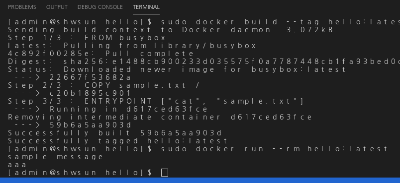
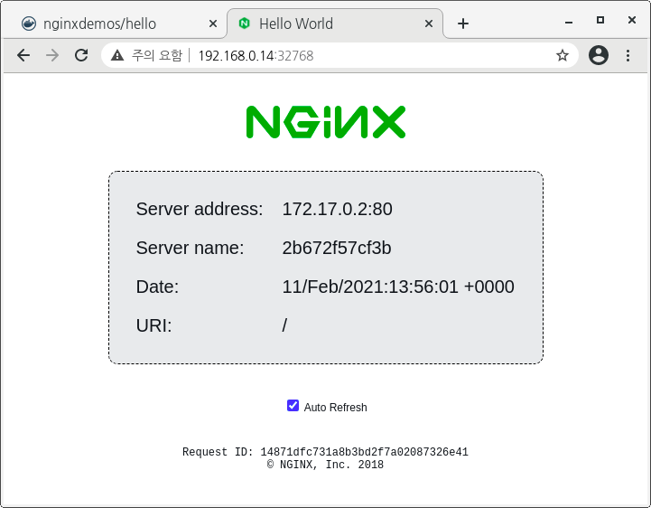

# Docker Custom image 만들기  

## Hello-world  
Dockerfile linux template   
경로 안의 `sample.txt` 파일의 내용을 출력하는 간단한 도커 이미지를 아래와 같이 생성할 수 있습니다.   
  
```Dockerfile
FROM busybox
COPY sample.txt /
ENTRYPOINT ["cat", "sample.txt"]
```
1. busybox latest(태그를 생략했기 때문에 최신) 이미지를 가져와서 사용  
2. 로컬 경로의 sample.txt 파일을 컨테이너 / 경로에 복사  
3. 도커 생성 후 cat 명령을 이용해서 복사해 둔 sample.txt 내용을 출력  
  
위와 같은 코드를 이용해 `Dockerfile` 명칭으로 파일을 생성하고 동일 경로에서 실행합니다.  
샘플 프로젝트의 `hello` 폴더에 미리 작성해 둔 파일이 있으니, 해당 경로로 이동해서 실행해도 됩니다.  
아래와 같이 도커 이미지를 빌드하고 실행합니다.  
```bash
sudo docker build --tag hello:latest . 
sudo docker run --rm hello:latest 
```
실행한 결과는 아래와 같습니다.  
   
  
## NGNINX Hello Web
아래와 같은 명령을 실행하면 웹 페이지를 서비스 하는 컨테이너를 실행해 둘 수 있습니다.  
```bash
sudo docker run -P -d nginxdemos/hello
```
컨테이너 실행 후, 웹 화면을 확인하려면 컨테이너 포트 매핑을 확인해서 외부에서 연결 가능한 주소를 호출합니다.  
```bash
sudo docker ps --format "table {{.Image}}\t{{.Status}}\t{{.Ports}}"
```
`0.0.0.0:32768->80/tcp` 과 같이 출력되면, 웹 브라우저로 `http://127.0.0.1:32768` 또는 `http://<host_ip>:32768` 로 연결 가능합니다.  
 

