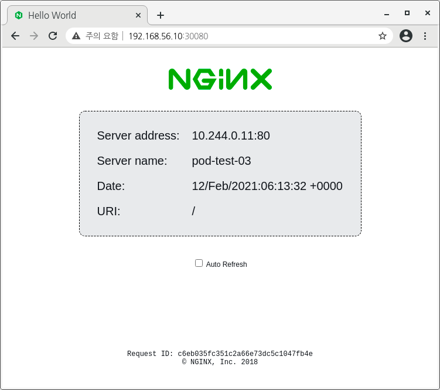

# K8S Tutorials  
K8S 클러스터 안에서 서비스 할 어플리케이션을 생성하고 서비스 하는 방법을 설명합니다.  
  
1. Hello Pod   
2. Hello-Web Pod 

---  
# Hello Pod 
K8s 마스터 노드에 연결해서 실행합니다.  
베이그런트로 작성해 둔 k8s vm을 사용하는 경우에는 아래와 같이 vm 에 연결합니다.  
```bash
vagrant ssh k8s
```
통합개발환경(비주얼 스튜디오 코드)을 원격으로 연결해 사용하는 방법도 있습니다.  
해당 내용은 따로 설명할 `Remote Development` 문서를 참고합니다.  
  
`examples/docker/hello`에서 작성한 도커 이미지를 이용합니다.   
***`k8s`에 도커 이미지를 준비해 두거나, k8s에서 아래와 같이 실행해 이미지를 생성해 둡니다.***    
```bash
sudo docker image ls 
# hello:latest 가 존재하지 않으면, examples/docker/hello 경로로 이동해서 
# 아래와 같이 빌드를 실행해 이미지를 만들어 두고 다음을 따라 합니다. 
# sudo docker build --tag hello:latest .  
```
```bash
kubectl apply -f - <<EOF
apiVersion: v1
kind: Pod
metadata:
  name: pod-test-01
spec:
  containers:
    - name: uses-hello-image
      image: hello:latest
      imagePullPolicy: IfNotPresent
  restartPolicy: Never
EOF
# wait a minute...
kubectl logs pod-test-01
```
  

###  nginx hello-web pod    
```bash
kubectl apply -f - <<EOF
apiVersion: v1
kind: Pod
metadata:
  name: pod-test-02
spec:
  containers:
    - name: uses-hello-web
      image: nginxdemos/hello
      imagePullPolicy: IfNotPresent
  restartPolicy: Never
EOF
```
서비스 등을 오픈하지 않았기 때문에 웹서버가 작동하고 있는 지 확인하려면 클러스터 내부에서 확인해야 합니다.  
해당 파드에 할당된 클러스터 ip를 알아내서 curl 이나 웹브라우저로 요청해서 확인할 수 있습니다.  
아니면, 직접 파드에 콘솔 로그인해서 프로세스가 작동하고 있는 지 확인할 수 있습니다.  
두번째 방법을 이용해서 확인하고, 여기에서 주소도 알아내서 다시 확인해 보겠습니다.  
`k8s` Web Dashboard에서 편하게 파드에 콘솔 연결할 수 있습니다.  
  
  
이 화면에서는 `pod-test-02`가 테스트용 파드 입니다.  
링크를 클릭해서 파드 상태 정보를 확인합니다.  
리소스 정보에서 클러스터 내부 IP를 확인할 수 있습니다.  
이 화면에서는 `10.244.0.7` 입니다.  
   
  
`파드에 Exec` 버튼을 누르면 파드에 콘솔 연결(ssh)할 수 있습니다.  
연결된 콘솔에서 `ip addr` 명령을 입력해서 대시보드에 표시된 클러스터 IP가 맞는 지 확인합니다.  
   
실행 중인 프로세스를 확인하면 nginx가 실행 중 임을 알 수 있습니다. 
또한, `eth0`에 표시된 ip가 웹 대시보드와 동일함을 알 수 있습니다.  
  
파드 콘솔 창을 닫고 클러스터 마스터 노드에서 curl로 nginx 웹 실행을 확인해 봅니다.  
```bash
curl http://10.244.0.7 
```
   
  
*** 간단하게 파드로 올려본 웹이 정상 작동하고 있음을 확인했습니다.  ***  
  
다음에는 이 파드를 서비스로 등록해서 클러스터 외부에서 접근할 수 있도록 해 보겠습니다.  
  
---  
# Hello NginX Service 등록
클러스터 내부에서 정상 작동하고 있는 파드에 서비스 자원을 할당해서 클러스터 외부에서 접근 가능하도록 하는 방법을 설명합니다.  
  
```bash
kubectl apply -f - <<EOF
apiVersion: v1
kind: Pod
metadata:
  name: pod-test-03
  labels:
    run: nweb
spec:
  containers:
    - name: uses-hello-web
      image: nginxdemos/hello
      imagePullPolicy: IfNotPresent
      ports:
        - containerPort: 80
  restartPolicy: Never
EOF
```
  
앞서 생성한 파드에 `labels` 와 `ports`를 추가했습니다.  
서비스로 노출하기 위한 정보입니다.  
```bash
# 라벨로 파드 조회
kubectl get pods  -l run=nweb -o wide
# 파드를 서비스에 연결해서 외부 노출. 라벨, 포트 정보가 있어야 작동.  
kubectl expose pod/pod-test-03
``` 
   
  
웹 대시보드 외에 아래와 같은 명령을 이용해 파드와 서비스 정보를 확인해 볼 수 있습니다.  
```bash
kubectl get svc pod-test-03  
```
```txt
NAME          TYPE        CLUSTER-IP       EXTERNAL-IP   PORT(S)   AGE
pod-test-03   ClusterIP   10.105.207.246   <none>        80/TCP    3m2s
```
```bash
kubectl describe svc pod-test-03  
```
```txt
Name:              pod-test-03
Namespace:         default
Labels:            run=nweb
Annotations:       <none>
Selector:          run=nweb
Type:              ClusterIP
IP Families:       <none>
IP:                10.105.207.246
IPs:               10.105.207.246
Port:              <unset>  80/TCP
TargetPort:        80/TCP
Endpoints:         10.244.0.9:80
Session Affinity:  None
Events:            <none>
```
```bash
kubectl get ep pod-test-03   
```
```text
NAME          ENDPOINTS       AGE
pod-test-03   10.244.0.9:80   6m52s
```
```bash
kubectl exec pod-test-03  -- printenv | grep SERVICE
```


## 서비스를 외부로 노출하기
NodePort 방식으로 서비스를 외부에 노출해 보겠습니다.  
NodePort는 노드(쿠버 클러스터의 마스터/워커 노드)에 주어진 IP에 포트 매핑 처리를 하는 방식으로 이해하면 됩니다.   
가상 머신 포트 포워딩 처리나 도커에서 포트 포워딩 처리한 것과 같습니다.  
```bash
kubectl apply -f - <<EOF
apiVersion: v1
kind: Service
metadata:
  name: pod-test-03
  labels:
    run: nweb
spec:
  type: NodePort
  ports:
  - port: 8080
    targetPort: 80
    nodePort: 30080
    protocol: TCP
    name: http
  selector:
    run: nweb
EOF
```
  
서비스나 파드로 조회되는 IP 모두로 조회할 수 있습니다.  
서비스는 포트 8080을 지정했기 때문에 해당 포트를 지정해야 연결할 수 있습니다.  
클러스터나 서비스 IP 외에 실제 머신(노드) IP로 접근 가능한 지 확인해 봅니다.  
여기에서는 `k8s` vm의 IP가 `192.168.56.10` 이기 때문에, 이 주소로 확인해 봅니다.  
`80`, `8080` 두 포트로 모두 연결해 보아도 연결되지 않습니다. 
머신으로 직접 연결하는 포트 매핑을 하지 않았기 때문 입니다.  

`nodePort: 30080`을 추가하고 다시 서비스를 생성해 봅니다.  
노드 포트는 `30000-32767` 범위로 지정해야 합니다.   
외부에서 마스터 노드의 IP로 연결해 보면 아래와 같이 연결 됩니다.  
   
  
위에 생성한 nginx 웹 서비스용 파드는 최소한 아래 3개의 IP를 보유한 상태입니다.  
1. 클러스터 아이피 : 파드 생성 시 부여한 클러스터 내부에서만 유효한 IP. 서비스 정의에서는 `targetPort`에 해당.  
2. 서비스 IP : 명시적으로 expose한 서비스. 서비스 정의에서는 `port`에 해당.  
3. Node(머신) IP : k8s 클러스터에 참여하는 노드(머신)의 IP. 서비스 정의에서는 `nodePort`에 해당.  

## Deployment 만들기
파드로 만든 웹 서버는 레플리카 설정 등을 할 수 없습니다.  
부하 분산이나 안정적인 서비스를 위해 클러스터의 레플리카 기능을 사용하려면 디플로이먼트로 만들어야 합니다.  
쿠버네티스 공식 사이트의 튜토리얼에서 `서비스와 애플리케이션 연결하기` 부분의 디플로이먼트 스크립트를 편집해서 사용합니다.  
샘플 스크립트 중 https 및 인증서 설정 등, 복잡한 부분을 모두 제거하고 필수 정보만 남겨서 아래와 같이 스크립트를 실행합니다.  
```bash
kubectl apply -f - <<EOF
apiVersion: apps/v1
kind: Deployment
metadata:
  name: dep-test-01
spec:
  selector:
    matchLabels:
      run: nweb
  replicas: 1
  template:
    metadata:
      labels:
        run: nweb
    spec:
      # volumes:
      # - name: secret-volume
      #   secret:
      #     secretName: nginxsecret
      # - name: configmap-volume
      #   configMap:
      #     name: nginxconfigmap
      containers:
      - name: dep-test-01
        image: nginxdemos/hello
        ports:
        - containerPort: 443
        - containerPort: 80
        # volumeMounts:
        # - mountPath: /etc/nginx/ssl
        #   name: secret-volume
        # - mountPath: /etc/nginx/conf.d
        #   name: configmap-volume
EOF
```
앞서 생성했던 파드와 동일한 서비스가 `dep-test-01` 라는 이름의 디플로이먼트로 등록되었고,  
파드 정보에 보면 `dep-test-01?????` 형태로 파드 하나가 이름 뒷부분에 해쉬값이 붙은 형태로 생성되어 있습니다.  
위의 스크립트에 미리 만들어 둔 서비스를 그대로 사용할 수 있도록 라벨을 `nweb`로 앞서와 동일하게 생성했습니다.  
따라서, 현재 서비스는 앞서 만든 파드와 디플로이먼트로 생성한 파드 2개를 보고 있습니다.  
서비스 정보를 이용해서 노드 IP로 웹 서비스를 호출해 봅니다.  
앞 서 만들었던 파드가 서비스되고 있습니다.  
파드 작동에 아무런 문제가 없기 때문에, 기존 파드가 그대로 서비스를 유지하고 있습니다.  
기존 파드인 `pod-test-03`을 삭제해 보겠습니다.  
다시 외부 IP를 이용해 서비스를 호출해 보면, 서비스는 정상 작동하지만,  서비스를 제공하고 있는 새로 생성한 파드로 바뀌었음을 확인할 수 있습니다.  
   
삭제했던  `pod-test-03`를 다시 생성해 봅니다.  
[Hello NginX Service 등록](#Hello NginX Service 등록) 에서 사용한 스크립트를 다시 실행하면 됩니다.  
   
새로 생성한 파드를 포함해 2개의 nginx pod가 실행되고 있습니다.  
다시 외부 IP로 웹 페이지를 호출해 봅니다.   
새로 생성한 `pod-test-03` 가 서비스로 연결되지 않고, `pod-test-03` 가 죽은 후에 서비스를 넘겨 받은 레플리카 파드가 서비스를 유지할 것으로 추측합니다.    
  
리플리카 파드를 죽이고 웹 페이지를 호출해 보면, 그때서야 `pod-test-03` 가 연결 될 것 입니다.  
이번에는 파드를 직접 삭제하지 않고, 디플로이먼트의 장점을 이용해 보겠습니다.  
대시보드에서 디플로이먼트 상세 정보를 확인하면, 디플로이먼트에는 파드와 다르게 `레플리카` 크기를 조절하는 기능이 있음을 알 수 있습니다.  
   
이 메뉴에서 레플리카 크기를 0 으로 스케일링 하면, 해당 디플로이먼트 정보로 생성하는 파드의 숫자를 0으로 유지하게 됩니다.  
파드를 삭제한 것과 같은 효과를 낼 수 있습니다.  
이렇게 리플리카 파드를 정지해 봅니다.  
   
사용자는 실제 물리적인 서버(파드)가 죽었어도, 새로운 서버에 자동 연결되기 때문에 동일한 서비스를 제공받음을 알 수 있습니다.  
   

