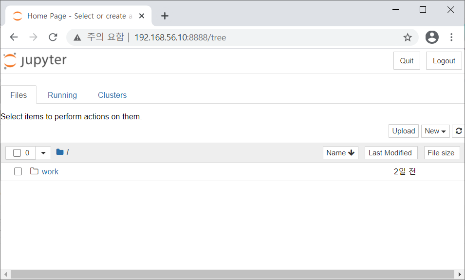
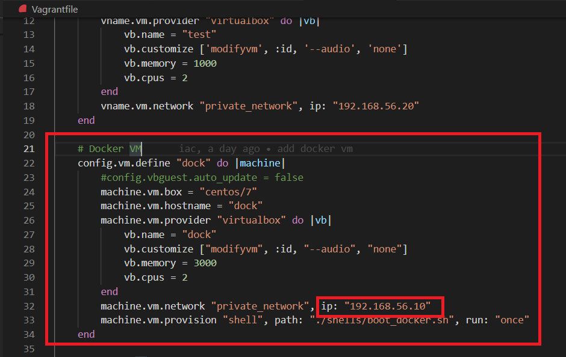
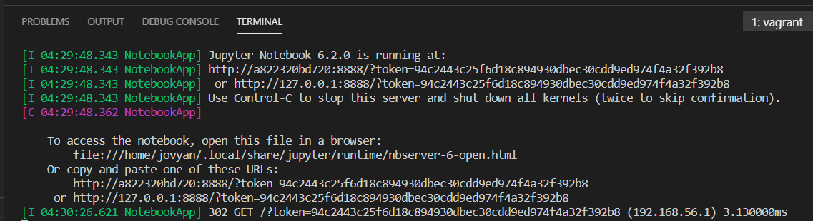

# Docker 에서 Jupyter Notebook 실행하기
python 머신러닝을 실행할 기본 환경이 설치된 도커 이미지를 실행하고 사용합니다.  
최종 결과는 아래와 같은 주피터 노트북에 연결해서 머신러닝 샘플 코드를 실행해 보는 것 입니다.  
  
  
여기에서는 VM 내부에 설치한 도커를 이용해 설명을 진행하지만, VM이 아닌 물리적인 머신에 설치된 도커에서 진행해도 과정은 동일합니다.  
아래와 같은 순서로 진행합니다.  

1. 도커 설치된 머신 준비
2. 주피터 도커 이미지 준비
3. 도커 실행 
4. 주피터 연결  
5. 종료하고 VM 빠져 나오기

---  

## 도커 설치된 머신 준비
물리적인 머신(Bare Metal 환경)에서 진행하는 경우 이 부분은 무시하고 지나갑니다.  
  
`Vagrantfile` 에서 아래 표시한 부분이 이 문서에서 사용할 VM 생성 스크립트 입니다.  
  
  
미리 생성해 둔 도커용 vm을 실행해서 연결합니다. 
```bash
# Vagrantfile 이 위치한 경로에서 아래 명령 실행
# Vagrantfile 안에 'dock' 라는 이름으로 vm 생성 스크립트 블럭이 이미 준비되어 있음.
vagrant up dock
# vm 실행이 완료되면 아래와 같은 명령으로 docker 설치된 리눅스 vm 콘솔에 연결.
# /home/vagrant 경로로 콘솔 연결됨.
vagrant ssh dock
```
도커가 설치된 리눅스 가상 머신이 실행되고 여기에 연결했습니다.  
  
리눅스 환경에 연결한 계정은 `vagrant`라는 이름을 가진 일반 사용자 계정입니다.  
권한을 올려두지 않았기 때문에, root 권한이 필요한 경우 매번 `sudo`를 실행하기 불편합니다.  
`root` 계정으로 변경한 후 나머지 작업을 진행하겠습니다.  
```bash
su - 
Password:
# 암호 입력을 요구합니다. 
# vagrant 라고 입력합니다. 
# 입력 후, [vagrant@dock ~] 와 같이 표시되던 프람프트가 
# [root@dock ~] 와 같이 변경됩니다. 
```
  
## 주피터 도커 이미지 준비
주피터 노트북 데이터싸이언스 용도로 생성된 도커 이미지를 가져 옵니다.  
아래와 같은 도커 풀 명령으로 도커 레지스트리에 있는 이미지를 다운로드 합니다.  
```bash
docker pull jupyter/datascience-notebook
# 내려왔는 지 확인
docker image ls 
```
  

## 도커 실행
노트북이 설치된 도커 이미지는, 실행시 노트북 웹 서버가 바로 실행되도록 작성합니다.  
도커 파일을 열어서 확인해 보지 않아도, 그렇게 되어 있을 것으로 보고,  
바로 주피터 노트북을 연결할 수 있게 도커를 실행하는게 편합니다.   
8888 기본 포트로 실행될 웹 서버에 외부(호스트, 도커를 실행하고 있는 머신)에서 연결할 수 있게 포트 매핑을 추가해서 실행합니다.  
```bash
docker run -p 8888:8888 -it jupyter/datascience-notebook
```
  
  

## 주피터 연결  
vm 생성 시, 머신의 ip를 `192.168.56.10` 과 같이 지정해 두었습니다.  
따라서, 주피터 노트북 서버가 실행되고 있는 도커를 포함하는 머신(vm)의 ip는 `192.168.56.10` 입니다.  
콘솔에 출력된 것 처럼 `127.0.0.1`로 연결하려면 vm 내부의 도커에 콘솔로 직접 연결해서 curl로 호출하는 경우,  
 `127.0.0.1`로 주피터 서버에 연결됩니다.  
vm 을 생성한 머신에서 브라우저로 연결해 볼 것이기 때문에, `127.0.0.1` 대신 `192.168.56.10` 를 사용합니다.  
```bash
http://127.0.0.1:8888/?token=fdbd58ac6364a172ed780d7dc3e88398ac593710f465b2d4 대신 
http://192.168.56.10:8888/?token=fdbd58ac6364a172ed780d7dc3e88398ac593710f465b2d4
```
  
콘솔창에 표시된 연결 문자열을 복사해서 `127.0.0.1` 대신 `192.168.56.10`로 변경합니다.  
이 URL을 브라우저에 붙여 넣으면 아래와 같이 노트북에 연결할 수 있습니다.  
  
  

## 종료하고 VM 빠져 나오기  
`Ctrl+C` 키를 누르면 실행 중이던 주피터 서버가 종료됩니다.  
현재 root로 전환한 상태라면 주피터 종료 후에 콘솔에 `exit`을 입력해서 전환 모드를 빠져 나옵니다.  
처음 로그인 했던 `vagrant` 사용자 상태에서 `exit`을 한번 더 입력하면 vm 콘솔이 연결 해제 됩니다.   
```bash
exit
exit
```
  
VM 연결 해제 상태이고, VM은 여전히 실행 중이기 때문에 dock VM 에 연결하려면 `vagrant ssh`로 가능합니다.  
VM을 종료하려면 `vagrant halt dock`을 입력해서 dock VM을 종료할 수 있습니다.  
dock VM 이 차지하고 있는 디스크 공간까지 회수하려면 `vagrant destroy dock`을 입력합니다.  
`destroy` 한 경우에는 다음 `vagrant up` 실행 시, OS image를 이용해 리눅스를 설치하는 작업부터 다시 실행되기 때문에  
실행이 오래 걸립니다.  
  
---  