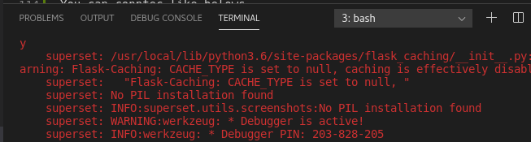
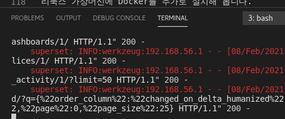
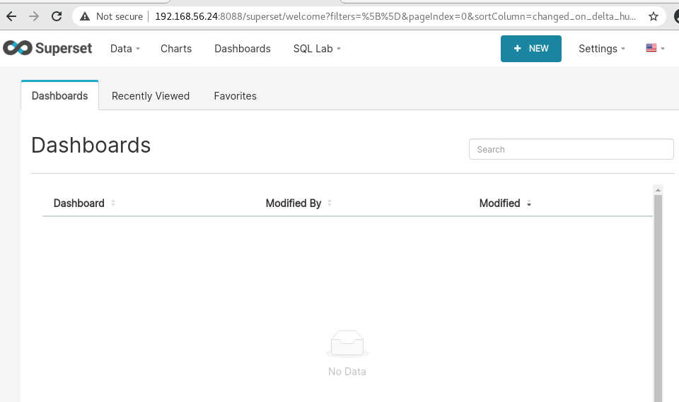

>>
| 예 제 |
|----|
|이렇게 생성해 둔 VM 을 사용하는 예제는 `examples` 폴더에 위치합니다. |
>> [./examples/README.md](./examples/README.md)
>> 
***  
  
>> Bare Metal K8s 설치는 VM 용 스크립트를 순서대로 실행해서 설치 진행한 상태.  
>> in linux bios setup AMD-V must be enabled !! 
>> 단, K8s Bare Metal용 CIDR 대역과 Virtual Box NAT 에 사용하는 대역이 충돌하지 않게, K8s 대역을 옮겨 설치한 상태.  
>> ***Bare Metal 설치 설명 추가해야 한다. !!!! ***  


## 도커 탑재 리눅스 
리눅스 가상머신에 Docker를 추가로 설치해 봅니다.  
도커를 이용해 작업할 일이 많기 때문에, 도커를 설치해 둔 리눅스 머신이 있을 경우 테스트하기 편합니다.  
```bash
vagrant up dock
vagrant ssh dock
```
  
## Superset VM
```bash
vagrant up superset
# http://192.168.56.24:8088 
```
  
You can connect like belows.  
`http://192.168.56.24:8088`  
  
  
  
  
shutdown superset  
```bash
# ^C 
vagrant halt superset
```
  

## K8s 클러스터 마스터 노드  
현재 마스터 노드는 최초 실행시에만 정상 작동하고,  
재 실행(destroy 하지 않고 다시 vagrant up 하는 경우)시, 앞서 남은 리소스 때문에 정상 작동하지 않습니다.  
수정 전까지는 destroy 이후 실행해야 정상 작동합니다.  
```bash
vagrant up k8s 
# few minutes after you can view K8s Dashboard Web UI using below URL
# http://10.250.106.233:18001/api/v1/namespaces/kubernetes-dashboard/services/https:kubernetes-dashboard:/proxy

# to stop k8s server
vagrant halt k8s
# k8s shutdown script will be called and few warning message which contains 'Device or resource busy' will be displayed. 
# ignore that message. after k8s vm is halted you can restart k8s vm using vagrant up command. 
```
  
VM K8s master API URL (VM 버전으로 GPU 사용 불가)  
  [http://10.250.106.233:18001/api/v1/namespaces/kubernetes-dashboard/services/https:kubernetes-dashboard:/proxy]   

### 외부 URL 연결 불가 시 방화벽 조치  
vm url()이나 host machine의 url() 이 모두 접근 가능한 상태임에도 불구하고 Dashboard 연결이 안 된다면,  
host machine에서 18001 포트를 열어 둔 상태인 지 확인해야 합니다.  
기본적으로 사용하는 포트가 아니기 때문에, 방화벽이 실행된 상태이면 막혀 있을 수 있습니다.  
```bash
# 방화벽 사용 확인
sudo systemctl status firewalld 
# 사용 중이면 포트 열려있는 지 확인 
sudo firewall-cmd --list-all
# 등록 안 된 상태이면, 18001 포트 추가
firewall-cmd --zone=public --permanent --add-port=18001/tcp
firewall-cmd --reload
```

또한, VM 종료시에도 K8s가 종료되지 않은 상태로 VM 강제 종료한 경우에는 꼭 vagrant destroy와 vm 삭제를 확인해야 합니다.  
그렇지 않으면, 다음 실행 시 정상 작동하지 않습니다.  
k8s 프로세스들을 종료하지 못한 경우에는 임시로 `sudo systemctl halt`로 머신을 강제 종료할 수 있습니다.  
이 경우 대부분 VM 과 vagrant의 상태 불일치가 발생하기 때문에, vagrant destroy 이후 vm 화면에서 해당 vm을 강제 삭제해야 합니다.  
***향후에 매끄럽게 종료하고 다시 실행하게 하는 코드를 추가할 예정이지만, 급하게 확인할 기능이 많아서 빠른 시간안에 추가하지는 못할 것 같습니다.***  

## Bare Metal K8s 설치  
POC 용 서버에 현재 작성해 둔 VM 용 스크립트를 재사용해서 K8s를 설치하는 방법을 설명합니다.  
POC linux 서버에서 GPU를 사용하는 K8s POD를 구성하려면, VirtualBox VM 이어서는 안 됩니다.  
따라서, GPU 사용 환경은 물리 서버에 직접 설치합니다.  
  
`shells` 폴더를 사용자 홈 경로 아래로 복사합니다.  
경로명은 임의로 지정해도 상관없습니다. 
`yml` 폴더를 사용자 홈 아래로 복사합니다.  
/home/user1/yml/<.yml 파일들> 형태로 배치되도록 해야 합니다.  
쉘 안에서 해당 경로의 yml 파일을 호출하기 때문 입니다.  
 
`start_master.sh` shell 에 현재 접속한 [서버의 ip, 사용자 계정, k8s master node name]을 인자로 추가해서 실행합니다.  
중간에 admin.conf 덮어쓰기 질문이 나오면 `y`를 입력합니다.  
```bash
cd shells
sudo chmod 755 *.sh 
./start_master.sh 10.250.106.233 user1 iap-test
./install_k8s_dashboard.sh user1
```

서버 재부팅 등으로 다시 실행해야 할 경우에는 아래 명령을 실행한 후에 다시 실행합니다.  
```bash
cd shells
./cleanup_k8s.sh
```
>> 설치는 `boot_docker.sh`, `boot_k8s.sh`, `boot_master.sh` 를 차례로 실행하면 됩니다.  
>> 단, ip와 host_name 등에 유의해야 합니다.  
>> 설치 시의 ip, host_name과 재기동시의 정보가 일치해야 합니다.  
  
만약, 8001 포트에서 proxy가 정상 작동하고 있다는 로그를 본 상태임에도 외부에서 url 연결이 안되면 방화벽 포트를 확인합니다.  
```
# root 계정으로 전환합니다. 비밀번호 입력해야 합니다. 
```bash
su - 
cat /etc/firewalld/zones/public.xml 
# 현재 18001 은 VM 으로 띄은 k8s 외부 연결용 포트
# 8001은 머신에서 직접 띄운 k8s 외부 연결용 포트로 사용
# 8001 포트가 등록되어 있지 않으면, vi 로 아래와 같은 문장(주석문자 # 제외하고) 추가
vi /etc/firewalld/zones/public.xml 
# <port protocol="tcp" port="8001" />
firewall-cmd --reload
```
*** restart 할 때 coredns 안 올라올 때 방화벽 확인 필요 ***  
  
  
Bare Metal K8s master API URL (추론엔진 설치용)  
  [http://10.250.106.233:8001/api/v1/namespaces/kubernetes-dashboard/services/https:kubernetes-dashboard:/proxy]  
## Git Lab VM  
  
## 

---  

## Host machine firewall setting
edit /etc/firewalld/zones/public.xml  
sudo firewall-cmd --reload  

